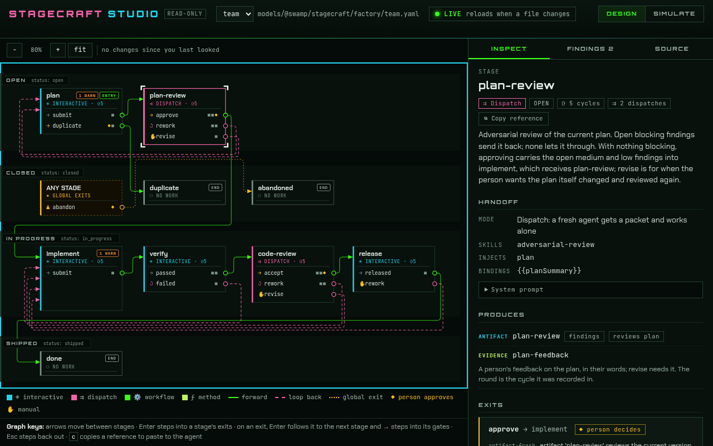

# stagecraft

stagecraft builds factories. A factory describes your process to do something
as a collection of **stages**. In each stage, stuff happens to make an
**artifact** or record **evidence**. The rules for moving from one stage to
another are described using **gates**.

A stagecraft factory keeps track of work items in the process and makes sure
they don't move until the gates say so. How work is driven through the factory
is up to you. Agents, humans, and plain old code can each drive different parts
of the flow. Where a person must decide, the work stops and waits for them.
stagecraft's role is limited to defining the stages and gates and keeping track
of each work item's state so that the transitions can be enforced.

A stage's work can be anything: an agent writing a plan, a subagent reviewing
it, a swamp model method or workflow run, or a person signing off. A factory
can be for whatever you can describe that way:

- **Writing software:** plan, review the plan, implement, verify, review the
  code, release.
- **Creating swamp extensions:** the same, with `swamp extension quality` as a
  gate and a registry push to release.
- **Managing a blog:** draft, editorial review, approval, publish.
- **Incident follow-up:** timeline, analysis, review, sign-off on the action
  items, publish.
- **Swamp models from an OpenAPI spec:** scope a slice of the API, map it to
  models, review the mapping, build and check them.

Each piece of work moving through a factory is a **work item**. It keeps a
journal of everything that happened, who decided what, and how long each stage
took.

## Getting started

In a directory for your project (skip `swamp init` if it is already a swamp
repo):

```sh
swamp init
swamp extension pull @swamp/stagecraft
```

That installs the stagecraft models and the stagecraft skill for your agent.
Then ask your agent:

> Set up a stagecraft factory for our post-incident reviews.

The skill walks you through it: what your process is in your own words, who
takes part, where a person decides, and what done means. It picks the closest
example, writes your factory, checks it with `validate`, and shows it to you in
the studio. From there it can start your first work item. You don't write the
factory definition by hand, and you don't need to know the terms below to
begin.

## The studio

The studio lets you visualize a factory in your web browser. Click a stage, an
exit or a gate to see what it does, and see where a person decides
(marked in gold). It reloads when the factory changes, and it is read-only:
your agent makes the edits, and you watch them land.



- **Design** displays the factory and runs the same checks as `validate`,
  listing anything it finds. You use **copy reference** on any stage and paste
  into your agent session to have it help you modify that stage.
- **Simulate** plays saved scenarios so you can see how work items flow.
- **Board** shows every work item in the factory, in a column for the stage
  it is in, and moves the cards as your agent advances them. A card says how
  long the item has been in the stage, whether it is waiting on a person
  (highlighted, with how long), whether a limit has parked it, and whether
  it runs an older version of the factory than the current one. Filter by
  any of those, or search by key or title.
- **Work item** (open a Board card, or type a key in the bar) shows one work
  item on its factory's graph: the stages it has been through, how often, the
  path it took, where it is now and what it waits on, in the same words as
  `status`. Its timeline lists everything that happened, and **copy as
  scenario** turns the run into a scenario your agent can save.

Each view has its own address, such as `/f/team/board`, so you can bookmark
it or share it with someone on the same machine.

Your agent starts it for you, or run it yourself:

```sh
swamp model create @swamp/stagecraft/studio studio --json
swamp model method run studio serve
```

`serve` logs the page's address, such as `http://127.0.0.1:38813/`, and runs
until you stop it with Ctrl-C. It listens on your machine only.

## Concepts

- **Factory:** your process, as a swamp model your agent creates and edits.
- **Factory definition:** the factory's stages, gates and transitions, held in
  the factory's model file.
- **Stage:** one step of the process: the work done there, by whom, and what it
  must produce.
- **Product:** what a stage produces. An **artifact** is a document such as a
  plan or a review, or a software change, or anything produced by the stage;
  **evidence** is a fact observed, such as a passing check or
  a person's feedback.
- **Gate:** a rule on leaving a stage, such as "the review has no blocking
  findings" or "a person approved the plan".
- **Transition:** a way out of a stage, forward or back, open when all its
  gates pass.
- **Work item:** one piece of work moving through a factory.
- **Human stop:** a point where only a person can move the work on: an
  approval, a decline, a way back, or giving up.
- **Journal:** the work item's record of every artifact and evidence created,
  along with each decision and move, and who made it.
- **Tracker:** where work items show up (e.g. issues or tickets). stagecraft
  has a minimal built-in tracker, and you can integrate with external trackers
  like Linear.

## Trackers

Every factory publishes its work items to a tracker, so each one has a ticket
whose status follows it through the stages.

**Built-in** is the default and needs no account: tickets live in your swamp
repo. The getting-started walkthrough sets it up; `prefix` starts each
ticket's id:

```sh
swamp model create @swamp/stagecraft/tracker board \
  --global-arg prefix=eng --json
```

**Linear** connects a Linear workspace. Put your Linear API key in a vault,
create the tracker, and fill in its settings in the model file `create`
prints:

```sh
swamp vault create local_encryption secrets
# Prompts for the key, without echoing it.
swamp vault put secrets linear-token
swamp model create @swamp/stagecraft/linear linear --json
```

```yaml
globalArguments:
  apiToken: ${{ vault.get(secrets, linear-token) }}
  teamId: <the id of the team new issues are filed in>
  statuses: { open: Todo, in_progress: In Progress, shipped: Done, closed: Canceled }
  types: { bug: Bug, feature: Feature }
```

The key needs write access; you can limit it to the team. `teamId` is the
team's UUID, not its short key such as ENG. `statuses` maps the factory's status
keys to your team's workflow states, and `types` maps each issue type to one of
your Linear labels. When work starts, the issue is assigned to the key's owner.
Check the connection by fetching an issue:

```sh
swamp model method run linear fetch_issue --input issue=ABC-1
```

Then ask your agent to use Linear for your factory. See
[REFERENCE.md](REFERENCE.md#linear) for every Linear method.

## Driving work

Ask your agent to start work, from a title or from a ticket, and it drives the
work item through the factory with the stagecraft skill. At each stage it reads
the work item's status, does the stage's work (itself, through subagents, or by
running a swamp model or workflow), records what the stage produced, and moves
on when exactly one way forward is open.

It stops and asks you whenever a person must decide. It shows you what the
stage produced and lays out your options, each with what it costs: approve,
decline, send the work back with your feedback, or abandon it. It never
approves its own work.

Every loop in a factory is bounded. A stage that has been reworked too many
times, or dispatched to agents too often in one pass, stops the work item until
a person grants an **override** to go round again. Overrides, like approvals,
are written in the journal with who granted them.

See the skill's [driving reference](.claude/skills/stagecraft/references/driving.md),
and its [human stops](.claude/skills/stagecraft/references/driving.md#human-stops)
in particular.

## Where to go next

- [Getting started](.claude/skills/stagecraft/references/getting-started.md):
  the walkthrough your agent follows for a first factory.
- [The stagecraft skill](.claude/skills/stagecraft/SKILL.md): how your agent
  authors a factory and drives its work.
- [Authoring](.claude/skills/stagecraft/references/authoring.md): how a factory
  is made and changed.
- [Saved scenarios](.claude/skills/stagecraft/references/scenarios.md): the
  paths `validate` checks your factory still allows.
- [The examples](.claude/skills/stagecraft/references/examples/) to start
  from, and
  [a whole work item, start to done](.claude/skills/stagecraft/references/examples/build-swamp-extension.md).
- [REFERENCE.md](REFERENCE.md): every method, the definition format, metrics
  and each tracker in detail.
- [DESIGN.md](DESIGN.md): how stagecraft works and why.
